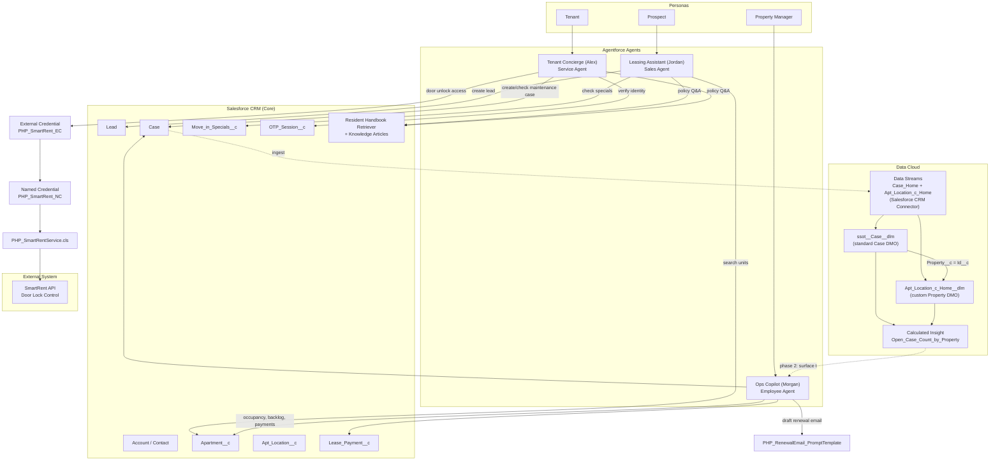

# Pacific Haven Properties — Agentforce Solution Architecture

## Diagram

## Narration Script (for the 0:00–0:10 walkthrough)

1. **Personas.** PHP has three distinct users: a **Prospect** browsing units, a **Tenant** managing their lease, and a **Property Manager** running the business. Each gets a purpose-built agent — not one generic bot trying to do everything.

2. **Request lifecycle.** Every message enters through that agent's router, which classifies intent each turn and hands off to a topic (subagent) scoped to one job — apartment search, lead capture, maintenance, identity verification, property reporting, renewal drafting. Topics don't reach into each other; the router re-evaluates every turn, so scope stays clean.

3. **Grounded data — CRM.** Each topic is backed by real Salesforce data: `Apartment__c`/`Apt_Location__c` for availability, `Move_in_Specials__c` for promotions, `Case` for maintenance, `Lease_Payment__c` for rent status, `OTP_Session__c` for identity verification. Policy questions are grounded in the Resident Handbook via a retriever, not the model's own guesses.

4. **Grounded data — Data Cloud.** `Case` and `Apt_Location__c` are streamed into Data Cloud through the standard Salesforce CRM connector. Case maps to Data Cloud's standard `ssot__Case__dlm` DMO; the property location maps to a custom `Apt_Location_c_Home__dlm` DMO. A Calculated Insight — `Open_Case_Count_by_Property` — joins the two on `Property__c = Id__c`, filters to open cases, and aggregates a live open-case count per property. This is intentionally minimal: real ingestion and a real, working metric, not yet a dependency for the live demo, so it can be extended (e.g. surfaced into Ops Copilot's weekly review) without disrupting a working agent.

5. **External system — SmartRent.** Tenant Concierge's door-unlock action doesn't talk to SmartRent directly. It calls a Named Credential (`PHP_SmartRent_NC`) backed by an External Credential (`PHP_SmartRent_EC`), invoked from `PHP_SmartRentService.cls` — so the integration secret never lives in the agent or the flow, and can be rotated or pointed at a different environment without touching agent logic.

6. **Why this shape.** Three scoped agents, one shared CRM data model, one real (if minimal) Data Cloud pipeline, and one credential-brokered external integration — this is the shape a production PHP rollout would keep, not a demo-only shortcut.
